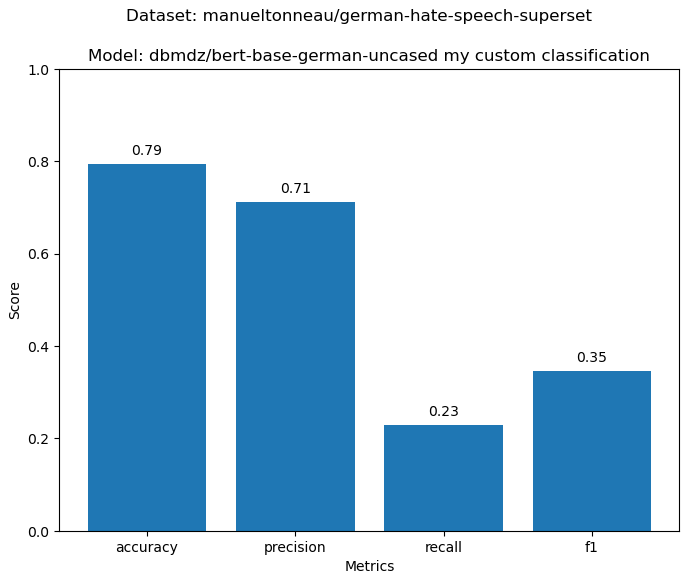

# Discord hate speech handler

This repository contains a POC hate speech detection project that was done for the university module "Deep Learning" (FH-SWF). The product is a discord bot that records the audio of individual users in a discord channel. It then uses foundational models like `wav2vec` to transcribe the audio file into text. This text is then analyzed for hate speech sentiment. If a user is flagged as propagating hate speech, measures can be taken. For the first action, I consider temporarily muting the user to be the most user-friendly option.

_The goal is to have a tool that promotes more friendly discord sessions._

## Bot usage

### Dependencies

- Install [libopus](https://github.com/xiph/opus) for audio preprocessing.
- Install Python packages using `pip install -r requirements-bot.txt`.

### Generate API token

Create an .env file and supply an API token for the discord bot (`DISCORD_BOT_TOKEN`). You can check how to create a token [here](https://discordpy.readthedocs.io/en/stable/discord.html). For simplification, here are additional hints and information:

- `Bot` section in the individual application under the [application settings](https://discord.com/developers/applications/):
    - `Privileged Gateway Intents` -> enable all.
    - `Public Bot` -> enable.
    - `Token` -> Generate an API token.
- Generate invite link:
    - `OAuth2` section -> `OAuth2 URL Generator` -> `bot` -> `administrator` -> `guild install`.

### Usage

Invite the bot via the generated OAuth2 URL and run the script `mutant_bot.py`. Join a channel with your normal discord client and make use of the following commands:

- `!join` -> bot joins the channel.
- `!record` -> bot starts hate speech detection.
- `!stop` -> bot stops hate speech detection.

## Research

The sentiment analysis is done via an already fine-tuned foundational model from [deepset](https://huggingface.co/deepset/bert-base-german-cased-hatespeech-GermEval18Coarse). Although this model has been trained with a specific dataset, which is already a few years old (GermEval18 -> 2018), I found larger datasets for hate speech classification. This made me wonder how well the pre-trained model actually performs and if I could train something that might even perform better.

### Dataset

The additional dataset I found was a superset that aggregated multiple hate-speech datasets into one, creating the largest bundled set of German hate speech available. The dataset is from [manueltonneau](https://huggingface.co/datasets/manueltonneau/german-hate-speech-superset) and contains ~50k samples. On the other hand, the GermEval18 dataset only contains ~8.5k samples.

### Foundational model

As a foundational model, I chose _dbmdz's_ [bert-base-german-uncased](https://huggingface.co/dbmdz/bert-base-german-uncased). I chose a BERT model because I thought it would be interesting to use the same underlying network structure as the pre-trained one, to see if more data actually makes a difference. Of course, `bert-base-german-uncased` is also already fine-tuned for the German language, and it may have been fine-tuned differently or better than _deepset's_ model in that realm, but I thought it was still a fair comparison.

## The process

Getting to the final results of the model was not straightforward. I faced several issues that had to be analyzed and fixed until I was satisfied with the results of the predictions.

The main problem I faced throughout the various training runs was that my loss never fell below _0.5_. I was able to fix this in the end. The various techniques implemented in the code are now listed in the order I implemented them.

### Adding dropouts for generalization

Initially, my training runs looked good in relation to the low number of epochs and the smaller initial training set. I thought not being under a loss of _0.5_ would simply be solved by more epochs and scaling up. At this stage, I noticed another problem. In my early test runs, the train and test sets always diverged _by a lot_ the longer my training runs continued.

That’s why I decided to look into what I could do to generalize more. I concluded that dropouts might be a good choice. They did help a little and contributed to the larger puzzle, but initially, no _great_ progress was noticeable.

### Adding more layers for better learning capabilities

I played around with many parameters, switched out the datasets, and did longer runs. Then I noticed the big issue, which was explained earlier. It seemed like I was unable to get below a loss of _0.5_. I thought that only having one linear layer concatenated at the output of the frozen BERT model might not have been enough. This made me wonder if adding more simple feed-forward layers could improve the model’s learning capabilities.

At this stage, I added linear layers with batch normalization and a dynamic learning rate process to ensure that when the model went down the right path, it stayed there. I even executed the model for a bit more than 24 hours but still did not notice a great improvement. I was not able to get below _0.5_.


### Prioritize Precision

I noticed a third issue, or rather the reason for the learning wall I seemed to have hit. It looked like my model had a decent accuracy in determining which sample to flag as hate speech. On the contrary, my precision—the metric that tells me how many false positives were mistakenly flagged as positive—was _extremely_ low (0.06 in one of the early training runs). I decided to implement techniques to avoid flagging things as positive if they were actually negative. Thus, I integrated the following techniques:

- Added weighted classes (getting class 0, no hate speech, wrong would penalize the model/loss harder).
- Balanced the training set (equal number of true hate speech cases and non-hate speech cases).
- Cleaned training data (removed unnecessary characters and normalized the text).

I noticed a great improvement with the application of these techniques, as seen in the graph below.


Also, my metrics improved substantially, as shown here. I achieved a precision of 0.72! I was very happy with the results.



### GPU acceleration

While experimenting with precision, I also ran another experiment. I used the larger dataset (hate speech superset, not GermEval18) and increased the epochs substantially. On my local machine, it was slow, but luckily I could use the compute cluster of my school. This sped up the process and allowed me to run the model for many epochs over more than a day. The amount of data compared to the GermEval18 set I was using before was roughly _6x_.

I got great results from that. Finally, my loss dropped to _~0.25_.


### The final run

The pipeline used here was very plain compared to how I tweaked it with the precision techniques. That’s why I thought that, even though the results were already satisfying enough, I wanted to see what both approaches would yield when combined. I did a small test run with the large dataset that showed a very nice test/ train curve until 50 epochs. Then it was time for the big run.


Hell yeah! That was a success for sure! It looks like all the various changes I applied to the model made it asymptote a bit arround _0.35_, but the generalization in this run is phenomenal! Test and train curve are essentially the same. I assume that all of the various changes, especially the dynamic learning rate, cause my model to learn more slowly. So theres probably potential for better results if one decides to let it run for an even longer period. The cost to benefit point was definetly reached at round about 100 epochs though.

### Publishing the model

At the end I also wanted to upload my model to huggingface, but had various issues loading my packaged model. I think the issue lies in that I did not construct my CustomBertClassifier by conventional rules and guidelines. I was trying to just extract the state_keys, but ended up having key missmatches at the loading stage. After a couple of hours I gave up.

```python
    raise RuntimeError('Error(s) in loading state_dict for {}:\n\t{}'.format(
RuntimeError: Error(s) in loading state_dict for CustomBertClassifier:
        Unexpected key(s) in state_dict: "bert.embeddings.position_ids".
```

## Results

The final model performs great from a generalization perspective and also from the metrics side.


It did have quite a low recall though, which tells me how reliable the model actually identifies positive hate speech cases, but that was fine. The reason for that is that this model's use case is to penalize users... And the last thing I wanna do is penalize users that have not done anything wrong. Thereby I put more of a focus on precision and accuracy.

In comparison to deepset's model, my model seems to be far more careful in flagging hate speech, which I think is definetly an improvement. Their model seems to be very harsh in general, achieving a recall of 1 for the german hate speech superset, but with very low precision and accuracy. For the GermEval18 dataset the values look similar.


## Conclusion

The project was quite fun, and I learned a lot. I think I have gained a new tool in my programmer’s toolbox. I feel equipped to research and implement various neural net architectures and make use of them. This will immensely help me tackle problems that are very difficult to solve using conventional deterministic programming.
